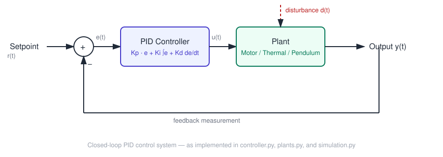

# PID Controller Tuner & Simulator

An interactive Streamlit app for tuning a PID controller against simulated
physical systems, with live plots of the step response, control effort,
and individual P/I/D contributions.

Built as a hands-on demonstration of classical control concepts — this
isn't just sliders and a chart, it implements anti-windup, derivative
filtering, disturbance rejection, and Ziegler-Nichols auto-tuning from
first principles.

## Features

- **Three plant models** to tune against:
  - **DC Motor (speed control)** — first-order system, fast dynamics
  - **Thermal system (heater)** — first-order-plus-lag system, slow dynamics
  - **Inverted pendulum (angle control)** — linearized unstable plant, the
    classic "hard mode" controls benchmark
- **Live PID tuning** — adjust Kp, Ki, Kd with sliders and see the closed-loop
  response update immediately
- **Anti-windup** — integral term clamps when the actuator saturates, so you
  don't get the classic windup overshoot
- **Filtered derivative term** — the D term is low-pass filtered so it
  doesn't amplify measurement noise (and derivative acts on the measurement,
  not the error, to avoid "derivative kick" on setpoint changes)
- **Disturbance injection** — kick the system mid-simulation and watch it
  reject the disturbance (or not, if it's badly tuned)
- **Ziegler-Nichols auto-tune** — runs an open-loop step test, fits a
  first-order-plus-dead-time (FOPDT) model, and suggests starting gains
- **Standard performance metrics** — rise time, percent overshoot, settling
  time (±2% band), steady-state error, ISE, and ITAE

## Quickstart

```bash
git clone https://github.com/Saeedam02/Python-Projects.git
cd Python-Projects/pid-tuner-simulator
pip install -r requirements.txt
streamlit run app.py
```

Then open the local URL Streamlit prints (typically `http://localhost:8501`).

## How to use it

1. Pick a plant in the sidebar.
2. Start with `Ki = Kd = 0` and increase `Kp` until the response is fast but
   just starting to oscillate.
3. Add `Ki` to eliminate steady-state error (watch it start to overshoot more).
4. Add `Kd` to damp that overshoot back down.
5. Or just click **"Suggest PID gains from open-loop step test"** for a
   Ziegler-Nichols starting point, then fine-tune from there.
6. Turn on **disturbance injection** to see how well your tune rejects a
   mid-run shock — this is often more revealing than the initial step
   response.

## Project structure

```
pid-tuner-simulator/
├── app.py            # Streamlit UI — wires everything together
├── controller.py      # PIDController: P/I/D with anti-windup + derivative filtering
├── plants.py           # Plant models (DC motor, thermal system, inverted pendulum)
├── simulation.py       # Closed-loop simulation runner
├── metrics.py           # Step-response performance metrics
├── tuning.py             # Ziegler-Nichols open-loop auto-tuner
└── requirements.txt
```

## Why these three plants

- The **DC motor** is a well-behaved, fast, stable first-order system — a
  good "does my PID even work" sanity check.
- The **thermal system** is slow with real lag, showing why integral
  windup matters and why derivative gain has to be handled carefully on
  noisy, sluggish systems.
- The **inverted pendulum** is open-loop *unstable* — it can't be tuned by
  the Ziegler-Nichols step-test method (there's no stable open-loop step
  response to fit), which is exactly the point: it demonstrates the limits
  of classical open-loop tuning methods and why the app tells you so
  instead of pretending to give an answer.

## Possible extensions

- Add a state-space / LQR comparison mode for the pendulum
- Add measurement noise and a Kalman filter option
- Export tuned gains + response plot to PDF/CSV
- Add a MIMO plant (e.g. coupled two-tank system) for multivariable tuning

## License

MIT
