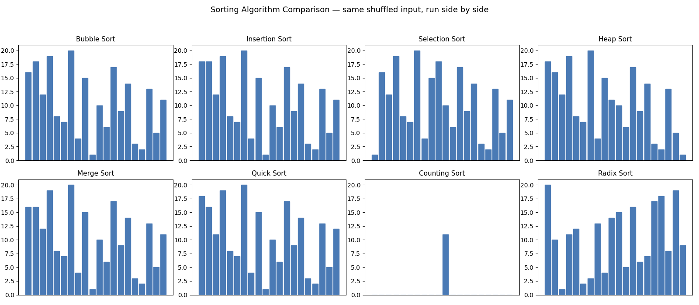

# 🔢 Sorting Algorithms — Some Classic Sorts, Implemented and Compared

Eight sorting algorithms, each in its own clean, heavily commented file,
plus a generated animation that runs all of them side by side on the same
shuffled input — so instead of just reading Big-O notation, you can watch
what it actually means for one algorithm to be faster than another.



*Watch Counting Sort and Radix Sort finish almost instantly while Bubble,
Insertion, and Selection Sort are still visibly working — that's O(n) /
O(n log n) versus O(n²), made visible instead of just stated.*

## What's in this collection


| File | Algorithm | Time complexity | Space | In-place? | Stable? |
|---|---|---|---|---|---|
| `bubble_sort.py` | Bubble Sort | O(n²), best O(n) | O(1) | ✅ | ✅ |
| `cocktail_sort.py` | Cocktail Shaker Sort | O(n²), best O(n) | O(1) | ✅ | ✅ |
| `insertion_sort.py` | Insertion Sort | O(n²), best O(n) | O(1) | ✅ | ✅ |
| `selection_sort.py` | Selection Sort | O(n²) always | O(1) | ✅ | ❌ |
| `shell_sort.py` | Shell Sort | O(n²) worst, gap-dependent | O(1) | ✅ | ❌ |
| `heap_sort.py` | Heap Sort | O(n log n) always | O(1) | ✅ | ❌ |
| `merge_sort.py` | Merge Sort | O(n log n) always | O(n) | ❌ | ✅ |
| `quick_sort.py` | Quick Sort | O(n log n) average, O(n²) worst | O(log n)* | ✅ | ❌ |
| `counting_sort.py` | Counting Sort | O(n + k)** | O(n + k) | ❌ | ✅ |
| `radix_sort.py` | Radix Sort | O(d·(n + k))** | O(n + k) | ❌ | ✅ |


*\*k = range of input values (counting sort), d = number of digits (radix sort). Both only support non-negative integers — see the notes below.*

Every file runs standalone and includes a small example at the bottom:

```bash
python bubble_sort.py
python merge_sort.py
python quick_sort.py
# ...etc
```

Each has also been stress-tested against Python's own built-in `sorted()`
across 150+ randomized inputs (including empty lists, single elements,
already-sorted, and reverse-sorted arrays) to confirm correctness — this
isn't just "code that looks right."

## Why these particular 8

They split naturally into three families, and the split *is* the lesson:

- **The O(n²) "teaching" sorts** — Bubble, Insertion, Selection. Simple to
  understand and implement, but they don't scale. Included because
  they're the right first step before appreciating why the faster ones
  are more complex.
- **The O(n log n) comparison sorts** — Heap, Merge, Quick. These are what
  you'd actually reach for on general data. Each makes a different
  trade-off: Merge Sort is stable but needs O(n) extra space; Quick Sort
  is in-place and fast in practice but has an O(n²) worst case (mitigated
  here with a random pivot); Heap Sort guarantees O(n log n) with O(1)
  space but isn't stable and tends to be slower in practice due to poor
  cache locality.
- **The non-comparison sorts** — Counting, Radix. These break the
  O(n log n) lower bound entirely by never comparing elements to each
  other — but only work under a real constraint (non-negative integers in
  a known range), which is exactly why they're not general-purpose
  replacements for the algorithms above.


## Honest limitations

- **Counting Sort and Radix Sort only support non-negative integers.** A
  natural extension is handling negatives (e.g. by shifting every value by
  the array's minimum before sorting, then shifting back).
- **Quick Sort's worst case is still O(n²)** on adversarial input, even
  with a random pivot — random pivoting makes that worst case
  astronomically unlikely rather than impossible.
- **The GIF is illustrative, not a benchmark.** Frame count roughly tracks
  operation count, but it isn't a substitute for actually timing the
  algorithms on real hardware with real input sizes — a good follow-up
  project in its own right.

## License

MIT


